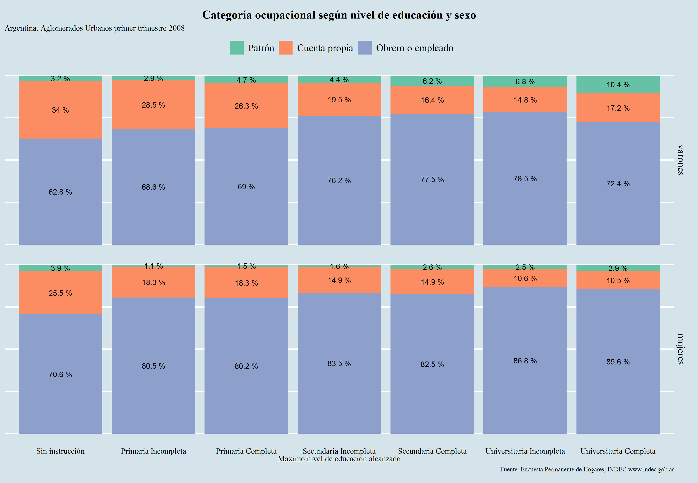
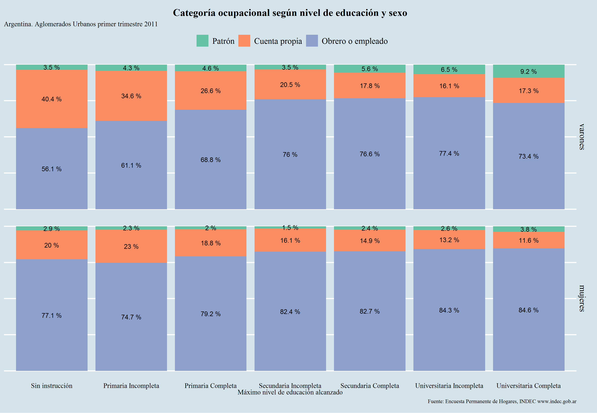
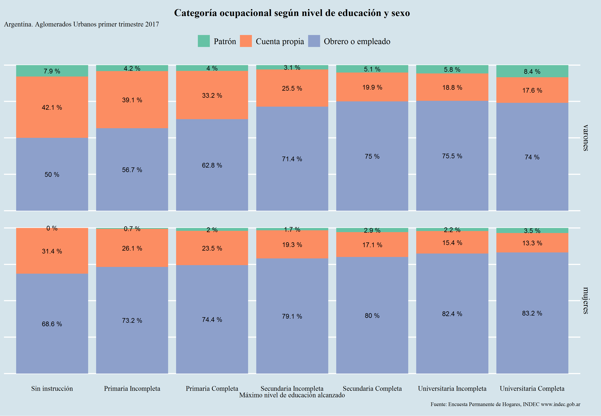

El objetivo de la serie que se inicia aquí es analizar los cambios en la inserción laboral de la población urbana de Argentina en los últimos 20 años. A modo de primer ejemplo, mostramos la evolución entre 2005 y 2018 de la participación en la actividad económica de varones y mujeres, según su nivel de educación. Las bases y los scripts están disponibles en https://github.com/ebologna/gender-gap  

## Cambios temporales de la distribución de las categorías ocupacionales por sexo y educación

